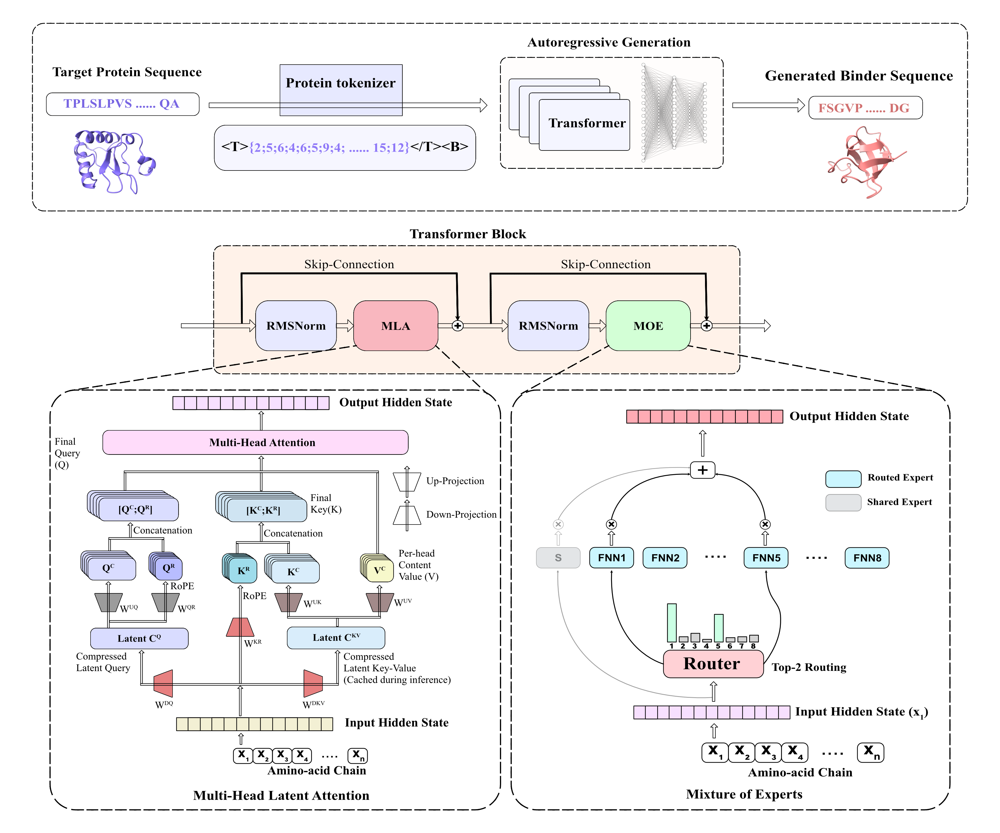

# MoE-Bind

De novo protein binder design has been dominated by structure-based pipelines
that require known three-dimensional target conformations and consume
substantial compute and generation time per design, limiting their throughput
and accessibility for routine large-scale binder exploration.
Sequence-only generative models promise a faster and lighter alternative, yet
existing systems remain uniformly dense and frequently reintroduce structural
computation at inference, undermining the core advantages they were intended
to deliver.

We present MoE-Bind, an autoregressive protein binder generator that,
for the first time in this domain, combines Multi-head Latent Attention with
a sparse Mixture-of-Experts feed-forward network
Despite activating less than half the per-token parameters of compute-matched
dense baselines, MoE-Bind matches or exceeds them on full-length
receptor-conditioned binder generation
Routing analysis on generated binders reveals interpretable expert
specialization at both the individual amino acid and biochemical group level,
a structured expert-token alignment not previously reported for
natural-language MoE models. These results show that sparse architectural design, rather than scale, can deliver fast, structure-free, and interpretable protein binder generation.

## Research Overview

[Watch on YouTube](https://www.youtube.com/watch?v=UgKDtqwGvag)




| Architecture | Attention | FFN 
|---|---|---|
| **MHA** (GPT-2 style) | Multi-Head Attention (dense) | MLP (GELU)
| **GQA** (LLaMA2 style) | Grouped-Query Attention | MLP (SwiGLU) 
| **MLA + MoE** (DeepSeekV3 style) | Multi-head Latent Attention | sparse MoE (top-2/8 + shared)


> This repository contains the model training code. A small demo dataset is
> included so the entire pipeline can be run end to end in a few minutes on
> CPU or GPU. The 100M paper-scale configs are also provided.

## Installation

This project uses [**uv**](https://docs.astral.sh/uv/) for dependency and
environment management.

**1. Install uv** (skip if you already have it — check with `uv --version`):

```bash
curl -LsSf https://astral.sh/uv/install.sh | sh
```

On Windows (PowerShell): `powershell -ExecutionPolicy ByPass -c "irm https://astral.sh/uv/install.ps1 | iex"`.
Alternatives: `pipx install uv`, `brew install uv`. After installing, restart
your shell (or `source $HOME/.local/bin/env`) so `uv` is on your `PATH`.

**2. Create the environment** from the repo root:

```bash
uv sync
```

That's it. `uv sync` reads `pyproject.toml` / `uv.lock`, fetches Python 3.12 if
it isn't already present, and creates a `.venv/` with the exact locked
versions. There is no separate "activate" step — prefix commands with
`uv run`:

```bash
uv run python -m scripts.train --config <config>
```

If you prefer an activated shell, `source .venv/bin/activate` also works.

Notes:
- The lockfile pins the **CUDA 12.6** PyTorch wheels (`torch==2.13.0+cu126`),
  pulled from the PyTorch index declared in `pyproject.toml`.
- For CPU-only, drop the `[tool.uv.sources]` / `[[tool.uv.index]]` blocks from
  `pyproject.toml` (or point them at `https://download.pytorch.org/whl/cpu`)
  and re-run `uv sync`.
- To add a dependency later, use `uv add <package>` rather than editing
  `pyproject.toml` by hand — it resolves and updates the lockfile in one step.
- Training logs to **Weights & Biases**. To run without logging in, set
  `export WANDB_MODE=offline` (or run `uv run wandb login`).
- All commands are run as modules (`uv run python -m scripts.<name>`) from the
  repo root.

## Quick demo (~ Fast, CPU-friendly)

The demo uses small models so the whole loop runs fast.

```bash
export WANDB_MODE=offline

# 1. Tokenize the raw pre-training FASTA -> .bin
uv run python -m scripts.data_tokenize --config configs/data_tokenize/demo_pretrain_tokenize.yaml

# 2. Pre-train (run any / all of the three architectures)
uv run python -m scripts.train --config configs/pretrain/demo/gpt2.yaml       # MHA
uv run python -m scripts.train --config configs/pretrain/demo/llama2.yaml     # GQA
uv run python -m scripts.train --config configs/pretrain/demo/deepseek.yaml   # MLA + MoE

# 3. Tokenize the raw fine-tuning CSV -> Arrow datasets
uv run python -m scripts.preprocess_finetune --config configs/finetune_preprocess/demo_finetune_preprocess.yaml

# 4. Fine-tune on PPI pairs
uv run python -m scripts.train --config configs/finetune/demo/gpt2.yaml
uv run python -m scripts.train --config configs/finetune/demo/llama2.yaml
uv run python -m scripts.train --config configs/finetune/demo/deepseek.yaml

# 5. Generate receptor-conditioned binders (filtered: run-length + repetitiveness + perplexity)
uv run python -m scripts.generate_batch --config configs/generate/gpt2.yaml
uv run python -m scripts.generate_batch --config configs/generate/llama2.yaml
uv run python -m scripts.generate_batch --config configs/generate/deepseek.yaml
```

Generation writes a CSV to `outputs/generated/<arch>/` with columns
`complex_id, generated_seq, seq_len, ppl`. Tune the `generation:` and
`filtering:` blocks in `configs/generate/*.yaml` to control sampling and
candidate selection.

## Reproducing at scale (100M)

The 100M paper-scale configs live in `configs/pretrain/*_100M.yaml` and
`configs/finetune/*_100M.yaml`. You supply your own corpora:

```bash
# Tokenize your full pre-training corpus (edit the FASTA path in the config first)
uv run python -m scripts.data_tokenize --config configs/data_tokenize/pretrain_tokenize.yaml

# Pre-train, then fine-tune (example: DeepSeek)
uv run python -m scripts.train --config configs/pretrain/deepseek_100M.yaml
uv run python -m scripts.preprocess_finetune --config configs/finetune_preprocess/finetune_preprocess.yaml
uv run python -m scripts.train --config configs/finetune/deepseek_100M.yaml
```

Approximate sizes: GPT2-100M ≈ 99.85M, LLaMA2-100M ≈ 100.7M, DeepSeek-100M ≈
102.7M total (~38.9M active per token; top-2 of 8 experts + shared expert).

## License

MIT — see [LICENSE](LICENSE).

## Citation

If you find this work useful, please cite:

```bibtex
@article{Sarkar2026MoEBind,
  author       = {Dipayan Sarkar and Chiranjib Sarkar},
  title        = {MoE-Bind: Guiding De Novo Protein Binder Generation with Sparse Experts},
  journal      = {bioRxiv},
  year         = {2026},
  doi          = {10.64898/2026.06.13.732043},
  url          = {https://www.biorxiv.org/content/early/2026/06/13/2026.06.13.732043}
}
```

Preprint: https://doi.org/10.64898/2026.06.13.732043
